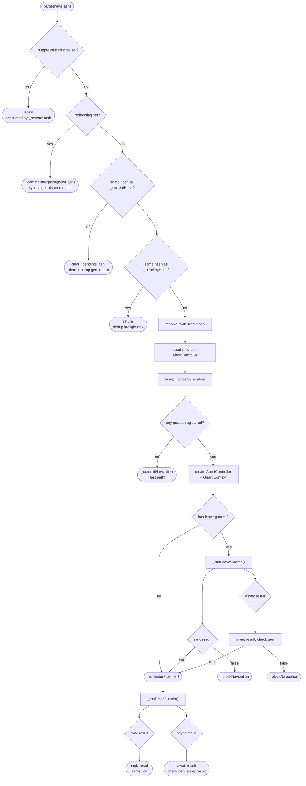
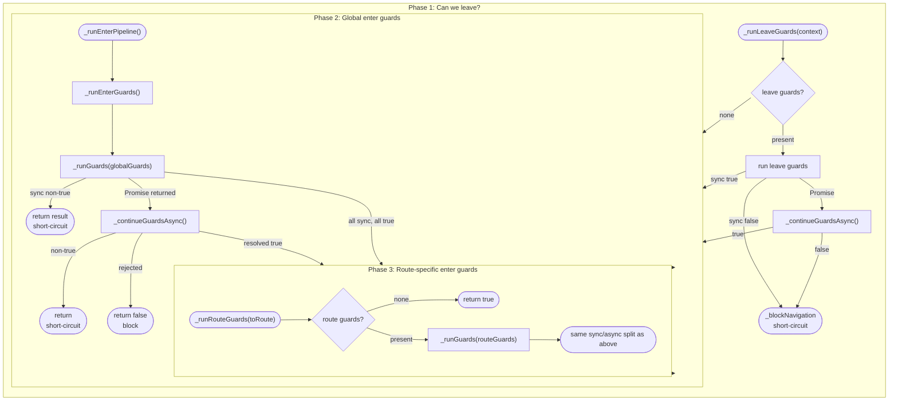
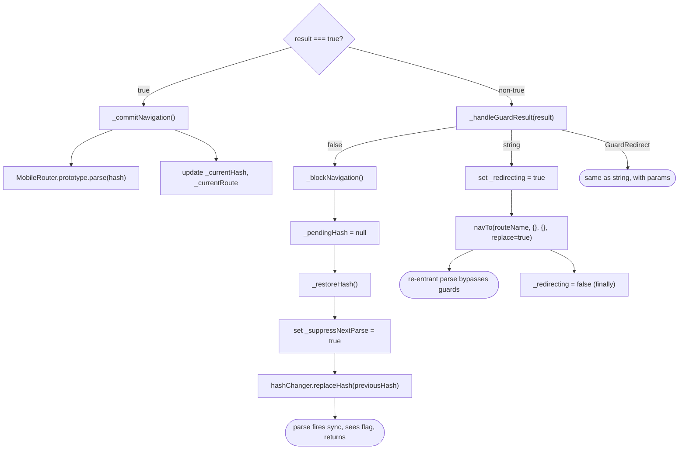

# Architecture

## Repository Structure

```
ui5-ext-routing/
|-- package.json                    npm workspaces root
|-- tsconfig.base.json              shared TypeScript config (strict mode)
|-- .oxlintrc.json                  linter config
|
|-- packages/
    |-- lib/                        the core library
    |   |-- ui5.yaml                OpenUI5 1.144.0, specVersion 4.0
    |   |-- src/
    |   |   |-- library.ts          Lib.init() entry point
    |   |   |-- Router.ts           extended Router (core implementation)
    |   |   |-- types.ts            all public type definitions
    |   |-- test/
    |       |-- qunit/              QUnit tests (unit)
    |       |-- wdio-qunit.conf.ts  runs QUnit in headless Chrome
    |
    |-- demo-app/                   demo application
        |-- ui5.yaml                serves lib + app with transpile
        |-- webapp/
        |   |-- Component.ts        guard registration example
        |   |-- manifest.json       routerClass: "ui5.ext.routing.Router"
        |   |-- controller/         Home, Protected, Forbidden
        |   |-- view/               XML views
        |-- test/
            |-- e2e/                wdi5 e2e tests
            |-- wdio.conf.ts
```

## High-Level Overview

The library provides a drop-in replacement for `sap.m.routing.Router` that adds async
navigation guards. Guards intercept every navigation path (programmatic `navTo`, browser
back/forward, direct URL changes) and can allow, block, or redirect before any route
matching, target loading, or event firing occurs.

```
+----------------------------------------------------------------------+
|                        Application (Component)                       |
|                                                                      |
|   router.addGuard(globalGuardFn)                                     |
|   router.addRouteGuard("protected", routeGuardFn)                    |
|   router.addLeaveGuard("editOrder", leaveGuardFn)                    |
|   router.initialize()                                                |
+----------------------------------------------------------------------+
         |                                                    ^
         | manifest: routerClass = "ui5.ext.routing.Router"   | navTo()
         v                                                    |
+----------------------------------------------------------------------+
|                     ui5.ext.routing.Router                            |
|                                                                      |
|   extends sap.m.routing.Router                                       |
|   overrides parse() to intercept all hash changes                    |
|                                                                      |
|   +--------------------+    +---------------------------+            |
|   | Guard Management   |    | Navigation Interception   |            |
|   |                    |    |                           |            |
|   | addGuard()         |    | parse() override          |            |
|   | removeGuard()      |    | _runLeaveGuards()         |            |
|   | addRouteGuard()    |    | _runEnterPipeline()       |            |
|   | removeRouteGuard() |    | _runEnterGuards()         |            |
|   | addLeaveGuard()    |    | _runRouteGuards()         |            |
|   | removeLeaveGuard() |    | _runGuards()          |            |
|   +--------------------+    | _continueGuardsAsync()    |            |
|                             | _validateGuardResult()    |            |
|                             | _commitNavigation()       |            |
|                             | _handleGuardResult()      |            |
|                             | _blockNavigation()        |            |
|                             | _restoreHash()            |            |
|                             +---------------------------+            |
+----------------------------------------------------------------------+
         |
         | MobileRouter.prototype.parse.call(this, hash)
         v
+----------------------------------------------------------------------+
|                      sap.m.routing.Router                            |
|                                                                      |
|   Route matching, Target loading, View creation, Event firing        |
+----------------------------------------------------------------------+
```

## Type System

All types are defined in `types.ts` and exported for consumer use.

```
GuardFn      = (context: GuardContext) => GuardResult | Promise<GuardResult>
LeaveGuardFn = (context: GuardContext) => boolean | Promise<boolean>

GuardContext                        GuardResult
+--------------+                   +---------------------------+
| toRoute      |  string           | true    -> allow          |
| toHash       |  string           | false   -> block          |
| toArguments  |  Record           | string  -> redirect       |
| fromRoute    |  string           | GuardRedirect -> redirect |
| fromHash     |  string           |   with params & targets   |
| signal       |  AbortSignal      +---------------------------+
+--------------+

GuardRouter (public interface)      RouterInternal (internal interface)
  extends sap.m.routing.Router        extends GuardRouter
  + 6 public guard methods             + 10 state fields
    addGuard / removeGuard             + 11 internal methods
    addRouteGuard / removeRouteGuard     (incl. _runRouteGuards,
    addLeaveGuard / removeLeaveGuard      _validateGuardResult)

  addRouteGuard / removeRouteGuard accept both:
    - GuardFn (enter guard)
    - { beforeEnter?, beforeLeave? } (object form)
```

Only strict `true` allows navigation. Truthy non-boolean values (numbers, objects, etc.)
are treated as blocks. This prevents accidental allow from coercion.

The `RouterInternal` interface exists because the Router uses UI5's `.extend()` pattern
(not ES6 `class extends`). Each method body declares `this: RouterInternal` as an explicit
this-parameter for full type safety. Application code casts to `GuardRouter` (the public
interface); `RouterInternal` is used only inside the Router method bodies.

## parse() Override - The Core Mechanism

Every navigation path in UI5 flows through `parse()`. The override intercepts it to run
guards before the parent router processes the hash.



**Critical design decisions:**

1. **`parse()` is intentionally NOT async.** UI5 calls it from the `hashChanged` event
   handler without awaiting. If it returned a Promise, routing would be deferred to a
   microtask, and test tools like wdi5's `waitForUI5` would see an idle event loop before
   navigation completes. When all guards are synchronous (the common case), the entire
   guard-check + route-activation happens in the same tick.

2. **`replaceHash` fires `hashChanged` synchronously.** The `_suppressNextParse` mechanism
   depends on this: `_restoreHash()` sets the flag, calls `replaceHash`, and the resulting
   synchronous `parse()` sees the flag and returns immediately. If UI5 ever changes
   `replaceHash` to fire `hashChanged` asynchronously, the flag would be reset before
   `parse()` can check it, causing a double navigation. A QUnit test validates this
   assumption.

3. **Redirect targets bypass guards.** When a guard redirects from route A to route B,
   the resulting `navTo` triggers a re-entrant `parse()` with `_redirecting = true`,
   which skips all guard evaluation. This prevents infinite loops but means route B's
   guards are **not** evaluated during a redirect. Design guard chains accordingly.

## Guard Execution Pipeline

Guards run in three phases: leave guards first, then global enter guards, then
route-specific enter guards. Each phase stays synchronous until a guard returns a
Promise, then switches to async for the rest.



Short-circuit: the first non-`true` result stops evaluation. Remaining guards are skipped.

Error handling: if a guard throws or its Promise rejects, the error is logged and
navigation is blocked (`false`).

## Guard Result Handling

After guards complete, the result is applied inline (no separate method):



## Async Concurrency Control

The `_parseGeneration` counter handles overlapping async navigations:


Every `parse()` that enters the guard pipeline bumps the generation. After each `await`,
the generation is rechecked. If a newer navigation started during the suspension, the
stale result is silently discarded. This ensures only the latest navigation wins.

The generation is also bumped on same-hash dedup, invalidating any pending async guard
that was running when the user navigated back to the original hash.

## Internal State

| Field                | Type                          | Purpose                                       |
| -------------------- | ----------------------------- | --------------------------------------------- |
| `_globalGuards`      | `GuardFn[]`                   | Guards that run for every navigation          |
| `_enterGuards`       | `Map<string, GuardFn[]>`      | Route-specific enter guards, by route name    |
| `_leaveGuards`       | `Map<string, LeaveGuardFn[]>` | Route-specific leave guards, by route name    |
| `_currentRoute`      | `string`                      | Name of the currently active route            |
| `_currentHash`       | `string \| null`              | Hash of the active route, `null` before first |
| `_pendingHash`       | `string \| null`              | Hash being evaluated by async guards          |
| `_redirecting`       | `boolean`                     | True during guard-triggered redirect          |
| `_parseGeneration`   | `number`                      | Monotonic counter for async invalidation      |
| `_suppressNextParse` | `boolean`                     | Suppresses parse from `_restoreHash`          |
| `_abortController`   | `AbortController \| null`     | Aborted when navigation is superseded         |

## Monorepo Tooling

```
                    npm workspaces
                         |
           +-------------+-------------+
           |                           |
     packages/lib               packages/demo-app
           |                           |
   ui5 serve (port 8080)       ui5 serve (port 8080)
   ui5-tooling-transpile       ui5-tooling-transpile
   (TS -> JS on the fly)       + transpileDependencies: true
                               + ui5-middleware-livereload
```

- **TypeScript**: strict mode, ES2022 target, composite project references
- **Build**: `ui5-tooling-transpile` compiles TS during `ui5 serve` and `ui5 build`
- **Lint**: `oxlint` with `eqeqeq`, `no-var`, `prefer-const` rules
- **Type check**: `tsc --noEmit` against both package tsconfigs

## Test Architecture

```
                          npm test
                             |
              +--------------+--------------+
              |                             |
         test:qunit                    test:e2e
              |                             |
  wdio-qunit-service              wdio + wdi5 service
  headless Chrome                  headless Chrome
              |                             |
  packages/lib/test/qunit/    packages/demo-app/test/e2e/
              |                             |
  +---------------------+     +---------------------------+
  | Router.qunit.ts     |     | routing-basic.e2e.ts      |
  |                     |     | guard-allow.e2e.ts        |
  | NativeRouterCompat  |     | guard-block.e2e.ts        |
  |  .qunit.ts          |     | guard-redirect.e2e.ts     |
  +---------------------+     | browser-back.e2e.ts       |
                               | direct-url.e2e.ts         |
                               | multi-route.e2e.ts        |
                               | nav-button.e2e.ts         |
                               | leave-guard.e2e.ts        |
                               +---------------------------+

  Unit tests verify:            E2e tests verify:
  - Guard lifecycle             - Full browser navigation
  - Sync/async pipelines        - Hash bar behavior
  - Redirect mechanics          - Back/forward buttons
  - Generation counter          - Guard block + redirect
  - Error handling              - Rapid hash changes
  - API parity with native      - Multi-step user flows
  - Leave guard pipeline        - Leave guard dirty form
```

QUnit tests run against the library in isolation using programmatic Router instances.
E2e tests run against the demo-app served by `ui5 serve`, exercising real browser
navigation, hash changes, and the full UI5 component lifecycle.

## Demo App Integration

The demo app shows the minimal integration pattern:

1. **manifest.json** - set `routerClass` to `"ui5.ext.routing.Router"` and add
   `"ui5.ext.routing": {}` to library dependencies
2. **Component.ts** - cast `getRouter()` to `GuardRouter`, register guards, call
   `initialize()`

```
  manifest.json                          Component.ts
  +----------------------------+         +----------------------------------+
  | routing.config.routerClass |-------->| router = getRouter() as          |
  | = "ui5.ext.routing.Router" |         |            GuardRouter        |
  |                            |         |                                  |
  | routes:                    |         | router.addRouteGuard("protected",|
  |   home     -> ""           |         |   () => isLoggedIn ? true : "home"|
  |   protected -> "protected" |         | )                                |
  |   forbidden -> "forbidden" |         |                                  |
  +----------------------------+         | router.addRouteGuard("forbidden",|
                                         |   () => "home"                   |
                                         | )                                |
                                         |                                  |
                                         | router.initialize()              |
                                         +----------------------------------+
```

The `IAsyncContentCreation` interface on the Component eliminates the need for
`async: true` in the manifest routing config.
