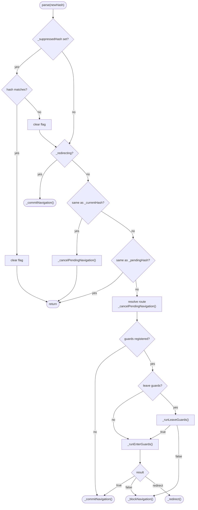
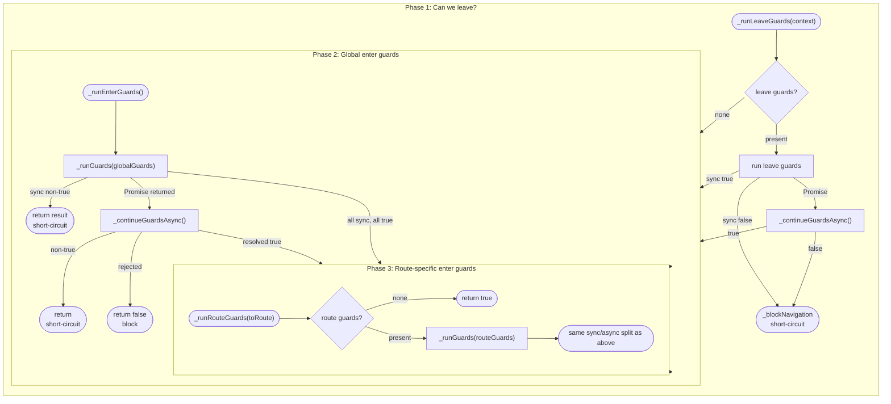
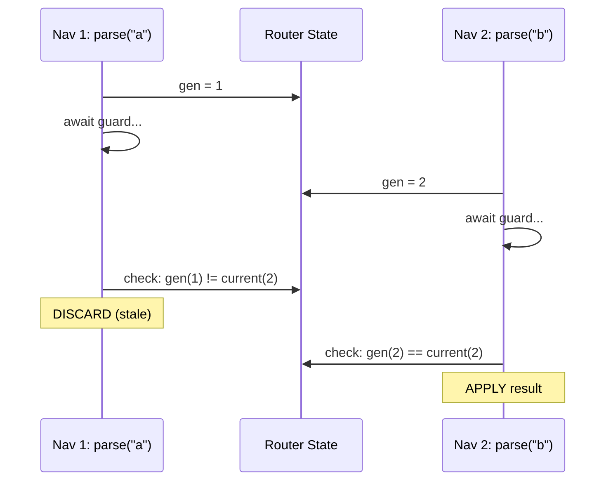
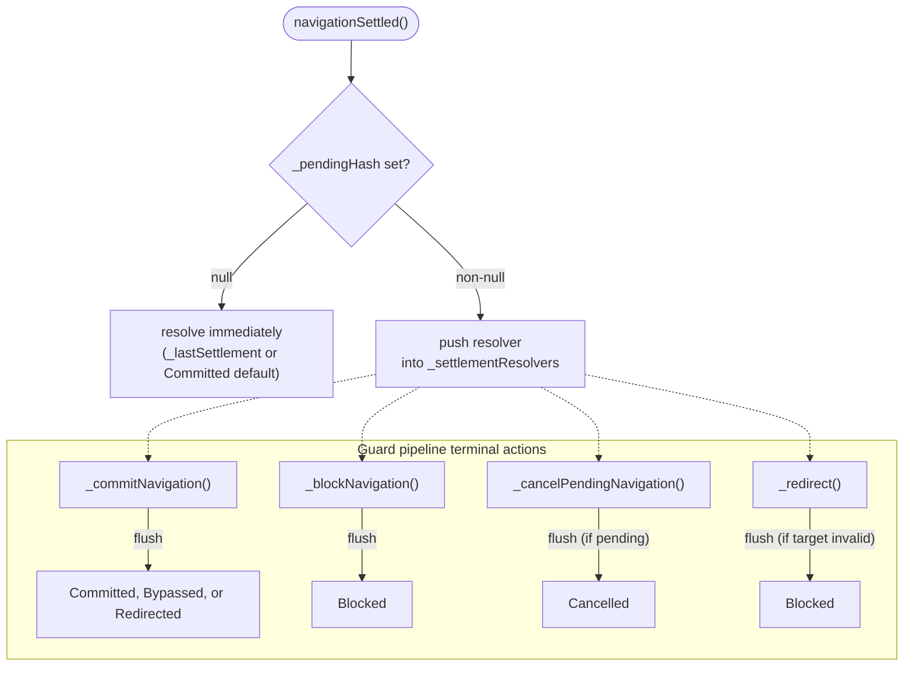

# Architecture

## Repository Structure

```
ui5-lib-guard-router/
|-- package.json                    npm workspaces root
|-- tsconfig.base.json              shared TypeScript config (strict mode)
|-- .oxlintrc.json                  linter config
|
|-- packages/
    |-- lib/                        the core library
    |   |-- ui5.yaml                OpenUI5 1.144.0, specVersion 4.0
    |   |-- src/
    |   |   |-- library.ts          Lib.init() entry point
    |   |   |-- Router.ts           extended Router (core implementation)
    |   |   |-- NavigationOutcome.ts  enum for settlement outcomes
    |   |   |-- types.ts            all public type definitions
    |   |-- test/
    |       |-- qunit/              QUnit tests (unit)
    |       |-- wdio-qunit.conf.ts  runs QUnit in headless Chrome
    |
    |-- demo-app/                   demo application
        |-- ui5.yaml                serves lib + app with transpile (OpenUI5)
        |-- ui5-flp.yaml            FLP preview config (SAPUI5, sap.ushell)
        |-- webapp/
        |   |-- Component.ts        guard registration example
        |   |-- manifest.json       routerClass: "ui5.guard.router.Router"
        |   |-- controller/         Home, Protected, Forbidden, NotFound
        |   |-- view/               XML views
        |   |-- guards.ts           guard factories (auth, dirty form, forbidden)
        |   |-- demo/               RuntimeCoordinator, ScenarioRunner
        |   |-- flp/                ContainerAdapter (ushell dirty-state provider)
        |   |-- model/              runtime model factory
        |   |-- routing/            hashNavigation helpers
        |-- test/
            |-- e2e/                wdi5 e2e tests (standalone)
            |-- flp/                wdi5 FLP preview smoke tests
            |-- wdio.conf.ts        standalone e2e config
            |-- wdio-flp.conf.ts    FLP preview e2e config
```

## High-Level Overview

The library provides a drop-in replacement for `sap.m.routing.Router` that adds async
navigation guards. Guards intercept every navigation path (programmatic `navTo`, browser
back/forward, direct URL changes) and can allow, block, or redirect before any route
matching, target loading, or event firing occurs.

```
+----------------------------------------------------------------------+
|                        Application (Component)                       |
|                                                                      |
|   router.addGuard(globalGuardFn)                                     |
|   router.addRouteGuard("protected", routeGuardFn)                    |
|   router.addLeaveGuard("editOrder", leaveGuardFn)                    |
|   router.initialize()                                                |
+----------------------------------------------------------------------+
         |                                                    ^
         | manifest: routerClass = "ui5.guard.router.Router"   | navTo()
         v                                                    |
+----------------------------------------------------------------------+
|                     ui5.guard.router.Router                            |
|                                                                      |
|   extends sap.m.routing.Router                                       |
|   overrides parse() to intercept all hash changes                    |
|                                                                      |
|   +--------------------+    +---------------------------+            |
|   | Guard Management   |    | Navigation Interception   |            |
|   |                    |    |                           |            |
|   | addGuard()         |    | parse() override          |            |
|   | removeGuard()      |    | _runLeaveGuards()         |            |
|   | addRouteGuard()    |    | _runEnterGuards()         |            |
|   | removeRouteGuard() |    | _runRouteGuards()         |            |
|   | addLeaveGuard()    |    | _runGuards()              |            |
|   | removeLeaveGuard() |    | _continueGuardsAsync()    |            |
|   | navigationSettled()|    | _validateGuardResult()    |            |
|   +--------------------+    | _commitNavigation()       |            |
|                             | _redirect()               |            |
|                             | _blockNavigation()        |            |
|                             | _flushSettlement()        |            |
|                             | _restoreHash()            |            |
|                             +---------------------------+            |
+----------------------------------------------------------------------+
         |
         | super.parse(hash)
         v
+----------------------------------------------------------------------+
|                      sap.m.routing.Router                            |
|                                                                      |
|   Route matching, Target loading, View creation, Event firing        |
+----------------------------------------------------------------------+
```

## Type System

All types are defined in `types.ts` and exported for consumer use.

```
GuardFn      = (context: GuardContext) => GuardResult | PromiseLike<GuardResult>
LeaveGuardFn = (context: GuardContext) => boolean | PromiseLike<boolean>

GuardContext                        GuardResult
+--------------+                   +---------------------------+
| toRoute      |  string           | true    -> allow          |
| toHash       |  string           | false   -> block          |
| toArguments  |  RouteInfo["arguments"] | string  -> redirect  |
| fromRoute    |  string           | GuardRedirect -> redirect |
| fromHash     |  string           |   with params & targets   |
| signal       |  AbortSignal      +---------------------------+
+--------------+

NavigationOutcome (UI5 enum)        NavigationResult
+----------------+                  +----------------------------+
| Committed      |  "committed"    | status: NavigationOutcome   |
| Bypassed       |  "bypassed"     | route:  string              |
| Blocked        |  "blocked"      | hash:   string              |
| Redirected     |  "redirected"   +----------------------------+
| Cancelled      |  "cancelled"
+----------------+

GuardRouter (public interface)      Router (ES6 class)
  extends sap.m.routing.Router        extends sap.m.routing.Router
  + 6 guard methods + 1 query         implements GuardRouter
    addGuard / removeGuard             + internal state fields
    addRouteGuard / removeRouteGuard   + private _cancelPendingNavigation()
    addLeaveGuard / removeLeaveGuard   + private _flushSettlement()
    navigationSettled()                + override parse(), stop(), destroy()

  addRouteGuard / removeRouteGuard accept both:
    - GuardFn (enter guard)
    - { beforeEnter?, beforeLeave? } (object form)
```

Only strict `true` allows navigation. Truthy non-boolean values (numbers, objects, etc.)
are treated as blocks. This prevents accidental allow from coercion.

`NavigationOutcome` is registered as a UI5 enum in `library.ts` via `DataType.registerEnum`.
The manifest dependency chain guarantees `library.ts` executes before `Router.ts` is loaded,
so `Router.ts` does not need to import `library.ts`. See [Library Loading Order Research](../research/library-loading-order.md)
for the full analysis of the Component bootstrap sequence.

The Router is an ES6 class that extends `sap.m.routing.Router` and implements the
`GuardRouter` interface. Application code casts `getRouter()` to `GuardRouter` for
type-safe access to the guard management methods. Internal state and methods live
directly on the class as typed fields; no separate internal interface is needed.

## parse() Override - The Core Mechanism

Every navigation path in UI5 flows through `parse()`. The override intercepts it to run
guards before the parent router processes the hash.



**Sync vs Async:** Guards run synchronously until one returns a Promise. From that point,
remaining guards `await` sequentially. After each await, the `_parseGeneration` is checked; if
a newer navigation started, the stale result is discarded.

**Critical design decisions:**

1. **`parse()` is intentionally NOT async.** UI5 calls it from the `hashChanged` event
   handler without awaiting. If it returned a Promise, routing would be deferred to a
   microtask, and test tools like wdi5's `waitForUI5` would see an idle event loop before
   navigation completes. When all guards are synchronous (the common case), the entire
   guard-check + route-activation happens in the same tick.

2. **`replaceHash` fires `hashChanged` synchronously.** The `_suppressedHash` mechanism
   depends on this: `_restoreHash()` stores the hash to suppress, calls `replaceHash`,
   and the resulting synchronous `parse()` sees the stored hash and returns immediately.
   If UI5 ever changes `replaceHash` to fire `hashChanged` asynchronously, the stored
   hash would be cleared before `parse()` can check it, causing a double navigation.
   A QUnit test validates this assumption.

3. **Redirect targets bypass guards.** When a guard redirects from route A to route B,
   the resulting `navTo` triggers a re-entrant `parse()` with `_redirecting = true`,
   which skips all guard evaluation. This prevents infinite loops but means route B's
   guards are **not** evaluated during a redirect. Design guard chains accordingly.

## Guard Execution Pipeline

Guards run in three phases: leave guards first, then global enter guards, then
route-specific enter guards. Each phase stays synchronous until a guard returns a
Promise, then switches to async for the rest.



Short-circuit: the first non-`true` result stops evaluation. Remaining guards are skipped.

Error handling: if a guard throws or its Promise rejects, the error is logged and
navigation is blocked (`false`).

## Guard Result Handling

After guards complete, the result is applied inline:

| Result                      | Action                                                      |
| --------------------------- | ----------------------------------------------------------- |
| `true`                      | `_commitNavigation()` → update state, call parent `parse()` |
| `false`                     | `_blockNavigation()` → restore previous hash                |
| `string` or `GuardRedirect` | `_redirect()` → `navTo()` with `replace=true`               |

Redirects set `_redirecting = true` before calling `navTo()`, causing the re-entrant
`parse()` to bypass all guards and commit immediately.

## Async Concurrency Control

The `_parseGeneration` counter handles overlapping async navigations:



Every `parse()` that enters the guard pipeline bumps the generation. After each `await`,
the generation is rechecked. If a newer navigation started during the suspension, the
stale result is silently discarded. This ensures only the latest navigation wins.

The generation is also bumped on same-hash dedup, invalidating any pending async guard
that was running when the user navigated back to the original hash.

## Settlement Signal

`navigationSettled()` returns a Promise that resolves when the guard pipeline finishes. The
result carries a `NavigationOutcome` enum value indicating how the navigation resolved.



Each terminal action in the guard pipeline (`_commitNavigation`, `_blockNavigation`,
`_cancelPendingNavigation`) calls `_flushSettlement()`, which drains all queued resolvers
with the same `NavigationResult`. `_redirect()` includes a safety-net flush that settles as `Blocked` when
`navTo()` does not trigger a re-entrant `parse()` (e.g. redirect to a
nonexistent route when the hash is already empty), because the observable
outcome is that the user stays on the current route. This ensures:

- Multiple callers of `navigationSettled()` for the same navigation all receive the same result
- Resolvers fire before `super.parse()` (in commit) and before `_restoreHash()` (in block),
  so consumers see the outcome before `routeMatched` events or hash restoration
- `_commitNavigation` uses the `_redirecting` flag and matched-route result to distinguish `Committed`, `Bypassed`, and `Redirected`
- `_cancelPendingNavigation` only flushes when `_pendingHash` is non-null, avoiding
  spurious settlement signals during initialization or when no navigation is in flight
- `_lastSettlement` caches the most recent result so that `navigationSettled()` called
  after a synchronous navigation still returns the correct outcome. This handles the
  common case where sync guards settle within the same tick as `navTo()`, leaving
  `_pendingHash` null before any caller has a chance to register a resolver. The cache
  is reset on `stop()` and `destroy()`

## FLP Integration

When the router runs inside a Fiori Launchpad (FLP), two independent dirty-state
mechanisms coexist:

| Mechanism                    | Scope             | UX                            |
| ---------------------------- | ----------------- | ----------------------------- |
| Router leave guard           | In-app navigation | Silent block + hash restore   |
| `registerDirtyStateProvider` | Cross-app (FLP)   | Native FLP confirmation popup |

**Key design rule:** the leave guard and the dirty-state provider handle
different scopes and do not need to coordinate in application code.

### Production FLP

In production, `ShellNavigationHashChanger` intercepts cross-app navigation
**before** it reaches the app router. The leave guard's `parse()` is never
called for cross-app hashes, so no conflict arises. The dirty-state provider
handles cross-app dirty UX, the leave guard handles in-app dirty UX, and
the two never overlap:

```ts
// Leave guard: blocks in-app navigation when dirty
const leaveGuard: LeaveGuardFn = (context) => {
	return !formModel.getProperty("/isDirty");
};

// Dirty-state provider: tells FLP about unsaved changes for cross-app
const dirtyProvider = (navigationContext) => {
	if (navigationContext?.isCrossAppNavigation === false) return false;
	return formModel.getProperty("/isDirty") === true;
};
sap.ushell.Container.registerDirtyStateProvider(dirtyProvider);
```

No `toRoute` check, no flags, no FLP detection -- just a simple dirty check.

### FLP sandbox/preview (development only)

The `fiori-tools-preview` middleware creates a simplified FLP sandbox for local
development. Cross-app navigation via `toExternal()` operates at the shell level
in both sandbox and production: the leave guard does not interfere because the
navigation bypasses the app router's `parse()`. The dirty-state provider fires
and the FLP shows its own confirm dialog. If the user confirms, the shell
completes the navigation. If the user cancels, the hash stays unchanged.

The demo app's FLP E2E tests pin this behavior in three spec files:
`flp-preview.e2e.ts` covers FLP runtime detection, in-app navigation inside the
sandbox, dirty cross-app cancel flow, in-app dirty blocking, and browser
history behavior under guards; `flp-cross-app.e2e.ts` covers the dirty
cross-app confirm path (dirty + `confirm()` returns `true`, navigation
completes to Shell-home) in an isolated browser session; and
`flp-clean-cross-app.e2e.ts` covers the clean cross-app path (no dirty prompt,
navigation proceeds directly to Shell-home) in its own isolated session.

## Internal State

| Field                  | Type                                | Purpose                                              |
| ---------------------- | ----------------------------------- | ---------------------------------------------------- |
| `_globalGuards`        | `GuardFn[]`                         | Guards that run for every navigation                 |
| `_enterGuards`         | `Map<string, GuardFn[]>`            | Route-specific enter guards, by route name           |
| `_leaveGuards`         | `Map<string, LeaveGuardFn[]>`       | Route-specific leave guards, by route name           |
| `_currentRoute`        | `string`                            | Name of the currently active route                   |
| `_currentHash`         | `string \| null`                    | Hash of the active route, `null` before first        |
| `_pendingHash`         | `string \| null`                    | Hash being evaluated by async guards                 |
| `_redirecting`         | `boolean`                           | True during guard-triggered redirect                 |
| `_parseGeneration`     | `number`                            | Monotonic counter for async invalidation             |
| `_suppressedHash`      | `string \| null`                    | Hash to suppress in the next `parse()` call          |
| `_abortController`     | `AbortController \| null`           | Aborted when navigation is superseded                |
| `_settlementResolvers` | `((r: NavigationResult) => void)[]` | Pending `navigationSettled()` callbacks              |
| `_lastSettlement`      | `NavigationResult \| null`          | Most recent settlement result (for post-hoc queries) |

## Monorepo Tooling

```
                    npm workspaces
                         |
           +-------------+-------------+
           |                           |
     packages/lib               packages/demo-app
           |                           |
   ui5 serve (default 8080)    ui5 serve (default 8080)
   ui5-tooling-transpile       ui5-tooling-transpile
   (TS -> JS on the fly)       + transpileDependencies: true
                               + ui5-middleware-livereload
```

- **TypeScript**: strict mode, ES2022 target, composite builds enabled
- **Build**: `ui5-tooling-transpile` compiles TS during `ui5 serve` and `ui5 build`
- **Lint**: `oxlint` with correctness (error), suspicious/perf (warn); typescript, oxc, unicorn, import plugins
- **Type check**: `tsc --noEmit` against both package tsconfigs
- **Test isolation**: root test scripts assign dedicated ports per lane so standalone, compatibility, and FLP suites can run concurrently without port conflicts

## Test Architecture

```
                          npm test
                             |
              +--------------+--------------+
              |                             |
         test:qunit                    test:e2e
              |                             |
  wdio-qunit-service              wdio + wdi5 service
  headless Chrome                  headless Chrome
              |                             |
  packages/lib/test/qunit/    packages/demo-app/test/e2e/
              |                             |
  +---------------------+     +---------------------------+
  | Router.qunit.ts     |     | routing-basic.e2e.ts      |
  |                     |     | guard-allow.e2e.ts        |
  | NativeRouterCompat  |     | guard-block.e2e.ts        |
  |  .qunit.ts          |     | guard-redirect.e2e.ts     |
  +---------------------+     | browser-back.e2e.ts       |
                               | direct-url.e2e.ts         |
                               | multi-route.e2e.ts        |
                               | nav-button.e2e.ts         |
                               | leave-guard.e2e.ts        |
                               +---------------------------+

  Unit tests verify:            E2e tests verify:
  - Guard lifecycle             - Full browser navigation
  - Sync/async pipelines        - Hash bar behavior
  - Redirect mechanics          - Back/forward buttons
  - Generation counter          - Guard block + redirect
  - Error handling              - Rapid hash changes
  - API parity with native      - Multi-step user flows
  - Leave guard pipeline        - Leave guard dirty form
  - Settlement outcomes         - Settlement-based wait

  Additional CI lanes (not part of `npm test`):

  test:e2e:flp                    test:qunit:compat:120
       |                               |
  packages/demo-app/test/flp/    packages/lib/test/qunit/
       |                          (same suite, OpenUI5 1.120.0)
  +------------------------------+   Verifies the core library's
  | flp-preview.e2e.ts           |   guard pipeline works on
  |   FLP runtime detection      |   the older UI5 runtime.
  |   In-app nav inside FLP      |
  |   Dirty cancel path          |
  |   Browser history in FLP     |
  | flp-cross-app.e2e.ts         |
  |   Dirty confirm path         |
  |   Isolated Shell-home exit   |
  | flp-clean-cross-app.e2e.ts   |
  |   Clean cross-app exit       |
  |   No dirty prompt            |
  +------------------------------+

  CI also runs:
  - node22-pack-smoke: build + pack + consumer type smoke on Node 22
  - windows-smoke: QUnit smoke on windows-latest
```

QUnit tests run against the library in isolation using programmatic Router instances.
E2e tests run against the demo-app served by `ui5 serve`, exercising real browser
navigation, hash changes, and the full UI5 component lifecycle.
FLP preview tests run the demo-app under `ui5 serve --config ui5-flp.yaml` (SAPUI5),
verifying that the ushell integration, dirty-state provider, and leave guard coexistence work.

## Demo App Integration

The demo app shows the minimal integration pattern:

1. **manifest.json** - set `routerClass` to `"ui5.guard.router.Router"` and add
   `"ui5.guard.router": {}` to library dependencies
2. **Component.ts** - cast `getRouter()` to `GuardRouter`, register guards, call
   `initialize()`

```
  manifest.json                          Component.ts
  +----------------------------+         +----------------------------------+
  | routing.config.routerClass |-------->| router = getRouter() as          |
  | = "ui5.guard.router.Router" |         |            GuardRouter        |
  |                            |         |                                  |
  | routes:                    |         | router.addRouteGuard("protected",|
  |   home     -> ""           |         |   () => isLoggedIn ? true : "home"|
  |   protected -> "protected" |         | )                                |
  |   forbidden -> "forbidden" |         |                                  |
  +----------------------------+         | router.addRouteGuard("forbidden",|
                                         |   () => "home"                   |
                                         | )                                |
                                         |                                  |
                                         | router.initialize()              |
                                         +----------------------------------+
```

The `IAsyncContentCreation` interface on the Component eliminates the need for
`async: true` in the manifest routing config.
